# Apple-Global-Product-Sales-Dataset-Analysis

Dalam era digital saat ini, data menjadi aset penting dalam pengambilan keputusan bisnis. Pada project ini, dilakukan analisis terhadap dataset Apple Global Product Sales Dataset untuk memahami performa penjualan produk Apple secara global serta mengidentifikasi faktor-faktor yang mempengaruhi pendapatan perusahaan.

Analisis ini bertujuan untuk menggali insight yang diharapkan hasil analisis ini dapat memberikan gambaran yang lebih jelas mengenai strategi bisnis yang efektif.

Melalui analisis ini, diharapkan dapat ditemukan insight yang relevan untuk mendukung pengambilan keputusan strategis berbasis data serta meningkatkan pemahaman terhadap dinamika penjualan produk Apple di pasar global.

## Dataset Description
Dataset Apple Global Product Sales Dataset berisi informasi terkait transaksi penjualan produk Apple secara global pada periode 2022 hingga 2024. Setiap baris merepresentasikan satu transaksi penjualan dengan berbagai atribut yang mencakup informasi waktu, lokasi, produk, pelanggan, serta performa penjualan.

Berikut penjelasan masing-masing variabel dalam dataset:

🧾 Informasi Transaksi
- sale_id → ID unik untuk setiap transaksi penjualan
- sale_date → Tanggal terjadinya transaksi
- year → Tahun transaksi
- quarter → Kuartal (Q1, Q2, Q3, Q4)
- month → Bulan transaksi

🌍 Informasi Lokasi
- country → Negara tempat penjualan terjadi
- region → Wilayah dalam negara (misalnya Asia, Europe, dll)
- city → Kota tempat transaksi

📱 Informasi Produk
- product_name → Nama produk Apple (misalnya iPhone, iPad, MacBook)
- category → Kategori produk
- storage → Kapasitas penyimpanan (contoh: 128GB, 256GB)
- color → Warna produk

💰 Informasi Harga & Penjualan
- unit_price_usd → Harga satuan produk dalam USD sebelum diskon
- discount_pct → Persentase diskon yang diberikan (%)
- units_sold → Jumlah unit yang terjual
- discounted_price_usd → Harga setelah diskon dalam USD
- revenue_usd → Total pendapatan dalam USD

💱 Informasi Mata Uang
- currency → Mata uang lokal transaksi
- fx_rate_to_usd → Nilai tukar mata uang lokal terhadap USD
- revenue_local_currency → Pendapatan dalam mata uang lokal

🛒 Informasi Transaksi & Pembayaran
- sales_channel → Kanal penjualan (online / offline)
- payment_method → Metode pembayaran (kartu kredit, transfer, dll)

👤 Informasi Pelanggan
- customer_segment → Segmentasi pelanggan (misalnya premium, regular)
- customer_age_group → Kelompok usia pelanggan
- previous_device_os → Sistem operasi perangkat sebelumnya (Android/iOS)
- customer_rating → Rating atau kepuasan pelanggan terhadap produk
- return_status → Status pengembalian produk (returned / not returned)

## Dataset Understanding
Pada tahap ini dilakukan eksplorasi awal terhadap dataset Apple Global Product Sales Dataset untuk memahami struktur, karakteristik, serta kualitas data sebelum dilakukan analisis lebih lanjut.

### Top 5 Data

Langkah pertama adalah menampilkan beberapa baris awal data menggunakan head() untuk memperoleh gambaran umum mengenai isi dataset, seperti format data, nama kolom, serta contoh nilai pada setiap variabel.

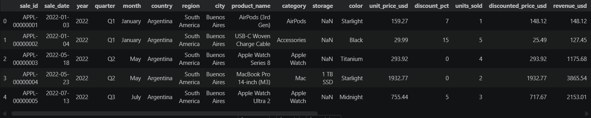

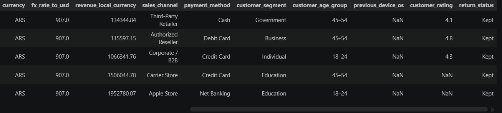
 
 
 
### Data Info

Selanjutnya dilakukan pengecekan struktur dataset menggunakan info() untuk mengetahui tipe data dari masing-masing atribut, jumlah data, serta mendeteksi adanya nilai yang tidak lengkap (missing values).

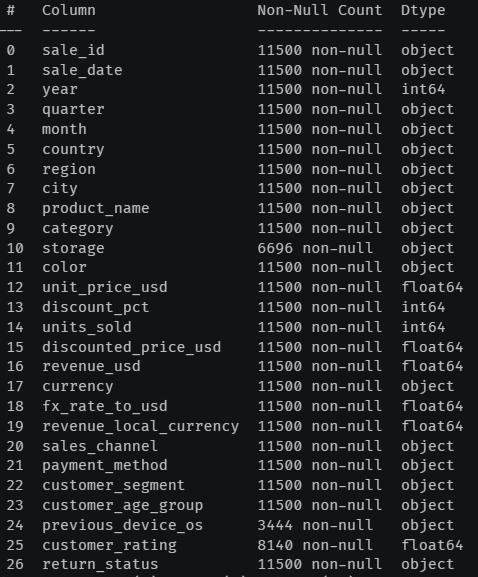

Berdasarkan hasil pengecekan, diketahui bahwa dataset memiliki beberapa tipe data, yaitu object (string), integer, dan float. Perbedaan tipe data ini akan disesuaikan kembali pada tahap preprocessing apabila diperlukan, agar sesuai dengan kebutuhan analisis dan memastikan hasil yang lebih akurat.
 
 
 
### Data Null

Selain itu, dilakukan juga identifikasi jumlah missing values pada setiap kolom menggunakan isnull().sum(). Tahapan ini bertujuan untuk memastikan kualitas data dan menentukan langkah preprocessing yang diperlukan sebelum masuk ke tahap analisis lebih lanjut.

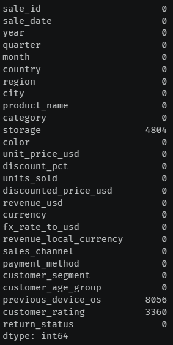

Berdasarkan hasil pengecekan, terdapat beberapa kolom yang memiliki nilai kosong (missing values), yaitu:
- storage : 4.804 data
- previous_device_os : 8.056 data
- customer_rating : 3.360 data

Keberadaan missing values pada kolom-kolom tersebut akan ditangani pada tahap data cleaning dengan metode yang sesuai, guna memastikan data yang digunakan dalam analisis lebih akurat dan representatif.
 
 
 
### Data Duplikasi
Selain itu, dilakukan juga pengecekan terhadap data duplikat menggunakan duplicated().sum() untuk memastikan tidak terdapat data yang terduplikasi yang dapat mempengaruhi hasil analisis.

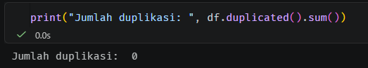

Berdasarkan hasil pengecekan, tidak ditemukan adanya data duplikat dalam dataset. Dengan demikian, tidak diperlukan tindakan lebih lanjut terkait penanganan duplikasi data.
 
 
 
### Statistical Summary
Selanjutnya, dilakukan analisis statistik deskriptif menggunakan describe() untuk memahami distribusi data serta mengidentifikasi potensi outlier pada variabel numerik.

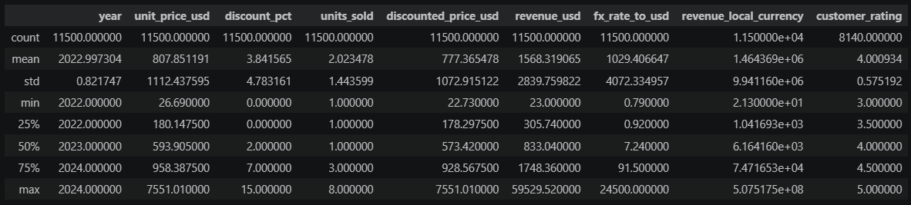
Berdasarkan hasil analisis statistik deskriptif, ditemukan adanya perbedaan yang signifikan antara nilai maksimum dan median pada beberapa variabel, yang mengindikasikan keberadaan nilai ekstrem (outlier) yang berpotensi mempengaruhi hasil analisis.

Secara lebih rinci, temuan pada masing-masing variabel adalah sebagai berikut:
1. unit_price_usd

Nilai maksimum tercatat sebesar 7.551, yang jauh lebih tinggi dibandingkan nilai median. Perbedaan yang signifikan ini mengindikasikan adanya outlier pada harga produk.
Meskipun hal ini masih memungkinkan karena adanya produk high-end (misalnya perangkat dengan spesifikasi tinggi), selisih yang terlalu besar tetap perlu ditinjau lebih lanjut untuk memastikan validitas data.

2. revenue_usd

Nilai maksimum mencapai 59.529, dengan selisih yang sangat besar dibandingkan nilai median. Hal ini menunjukkan adanya outlier yang kuat (strong outlier), yang kemungkinan disebabkan oleh transaksi dengan jumlah pembelian besar atau anomali dalam data.

3. fx_rate_to_usd

Ditemukan nilai maksimum sebesar 24.500, yang sangat tidak proporsional dibandingkan nilai median. Kondisi ini merupakan indikasi kuat adanya anomali (red flag), karena nilai tukar terhadap USD umumnya tidak berada pada rentang tersebut dalam konteks normal.

4. revenue_local_currency

Nilai maksimum mencapai 507 juta, yang menunjukkan perbedaan ekstrem dibandingkan nilai tengahnya. Nilai ini kemungkinan dipengaruhi oleh tingginya nilai pada variabel fx_rate_to_usd, sehingga terdapat keterkaitan antar variabel yang memperkuat indikasi adanya outlier.

Secara keseluruhan, keberadaan outlier pada variabel-variabel tersebut perlu ditangani pada tahap data cleaning, baik melalui validasi data, transformasi, maupun metode penanganan outlier lainnya, agar hasil analisis menjadi lebih akurat dan representatif.
 
 
 

Melalui proses ini, diperoleh pemahaman awal mengenai kondisi dataset sehingga dapat membantu dalam menentukan strategi analisis yang tepat pada tahap berikutnya.
 
 
 

## Cleaning Dataset
Setelah dilakukan proses eksplorasi awal dan evaluasi kualitas data, ditemukan beberapa permasalahan pada dataset seperti missing values, inkonsistensi format, serta indikasi outlier pada beberapa variabel. Temuan ini menunjukkan bahwa data mentah masih memerlukan perbaikan agar lebih akurat, konsisten, dan siap digunakan pada tahap analisis berikutnya.

Oleh karena itu, tahap selanjutnya adalah data cleaning atau pembersihan dataset, yang bertujuan untuk menangani berbagai permasalahan tersebut melalui proses seperti penanganan missing values, validasi data, standarisasi variabel, serta koreksi terhadap nilai-nilai yang tidak sesuai. Proses ini sangat penting untuk memastikan bahwa hasil analisis yang dilakukan nantinya lebih valid, representatif, dan dapat dipercaya.

 

### Penanganan Missing Values pada Variabel "storage"

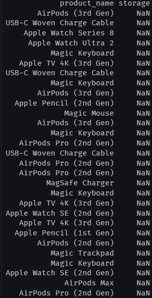

Ditemukan sebanyak 4.804 missing values pada variabel storage. Setelah dilakukan pemeriksaan lebih lanjut terhadap produk-produk dengan nilai null, diketahui bahwa sebagian besar missing value tersebut berasal dari produk yang memang tidak memiliki atribut kapasitas penyimpanan (storage) yang relevan, seperti AirPods, USB-C accessories, Magic Keyboard, dan beberapa aksesori lainnya.

Oleh karena itu, missing values pada variabel storage tidak dianggap sebagai kesalahan data, melainkan mencerminkan kondisi produk yang memang tidak memerlukan informasi storage sebagai spesifikasi utama.

Seluruh nilai null pada variabel storage diisi dengan kategori: "Not Applicable"

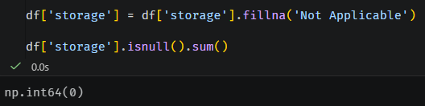

Alasan:
- Menjaga konsistensi data kategorikal
- Menghindari penghapusan data yang sebenarnya valid
- Memudahkan proses analisis dan encoding pada tahap preprocessing
- Membedakan antara “data hilang karena error” dan “data tidak relevan secara atribut”

Catatan:
Meskipun beberapa produk seperti Apple Watch secara teknis memiliki kapasitas penyimpanan internal, storage bukan merupakan spesifikasi utama yang umum digunakan dalam keputusan pembelian dibandingkan produk utama seperti iPhone, iPad, atau MacBook. Selain itu, informasi storage pada kategori tersebut sering kali tidak dicantumkan secara konsisten dalam dataset, sehingga untuk menjaga standardisasi, produk non-mainstream juga dikelompokkan ke dalam kategori “Not Applicable”.

 

### Penanganan Missing Values pada Variabel "previous_device_os"

Variabel previous_device_os memiliki 8.056 missing values, jumlah yang sangat besar sehingga dapat mengurangi kualitas analisis jika tetap digunakan.

Meskipun variabel ini berpotensi memberikan insight terkait perangkat sebelumnya yang digunakan pelanggan, proporsi data kosong yang terlalu tinggi membuat imputasi kurang akurat dan berisiko menimbulkan bias.

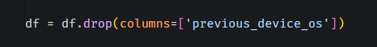

Alasan:
- Missing values terlalu banyak
- Imputasi tidak representatif
- Mengurangi noise pada dataset
- Fokus pada variabel yang lebih lengkap dan relevan

 

### Penanganan Missing Values pada Variabel "customer_rating"

Variabel customer_rating memiliki 3.360 missing values. Jumlah ini masih tergolong dapat ditangani tanpa perlu menghapus variabel, sehingga nilai kosong diisi menggunakan median.

Pemilihan median dilakukan karena lebih stabil terhadap outlier dibandingkan mean, sehingga dapat menjaga distribusi data tetap representatif.

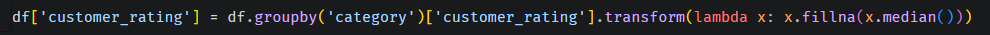

Alasan:
- Jumlah missing values masih dapat dikelola
- Variabel tetap dipertahankan untuk analisis
- Median lebih aman terhadap nilai ekstrem
- Menjaga distribusi data lebih stabil

 

### Penanganan Outlier pada Variabel "unit_price_usd"

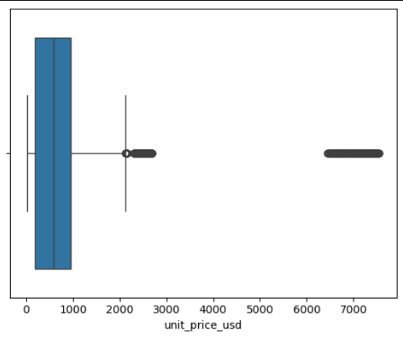

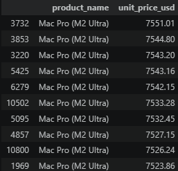

Berdasarkan hasil analisis distribusi data melalui plot serta pemeriksaan terhadap 10 nilai tertinggi pada variabel unit_price_usd, ditemukan bahwa nilai maksimum sebesar 7.551 USD bukan merupakan anomali atau kesalahan data.

Nilai maksimum pada unit_price_usd dipertahankan tanpa penghapusan maupun transformasi karena teridentifikasi sebagai harga produk Mac Pro (M2 Ultra) yang termasuk kategori high-end, sehingga masih relevan dan valid secara bisnis.

Alasan:
- Nilai tinggi berasal dari produk nyata
- Masih sesuai dengan kategori produk premium Apple
- Bukan kesalahan input data
- Tetap penting untuk merepresentasikan variasi harga sebenarnya

 

### Penanganan Outlier pada Variabel "unit_price_usd"

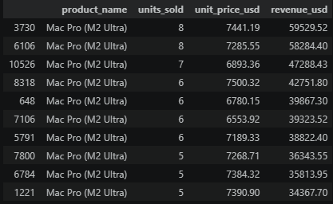

Nilai maksimum pada revenue_usd dipertahankan tanpa penghapusan maupun transformasi karena berdasarkan hasil pemeriksaan top 10 data tertinggi, nilai sebesar 59.529 USD berasal dari transaksi pembelian produk Mac Pro (M2 Ultra) sebanyak 5–8 unit dengan harga per unit sekitar 6.893,36–7.441,19 USD, sehingga nilai revenue tersebut masih valid secara logis dan bisnis.

 

### Penanganan Outlier pada Variabel "fx_rate_to_usd"

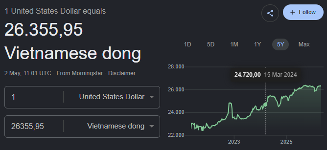

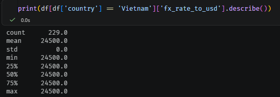

Nilai maksimum pada fx_rate_to_usd sebesar 24.500 dipertahankan tanpa penghapusan maupun transformasi karena setelah dilakukan validasi, nilai tersebut merepresentasikan kurs riil 1 USD terhadap Dong Vietnam pada periode 2022–2024, sehingga meskipun terlihat ekstrem dibandingkan median, nilai tersebut merupakan perbedaan karakteristik mata uang antarnegara dan bukan merupakan outlier atau kesalahan data.

 

### Penanganan Outlier pada Variabel "revenue_local_currency"

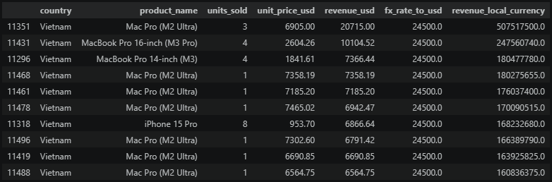

Nilai maksimum pada revenue_local_currency dipertahankan tanpa penghapusan maupun transformasi karena nilai sebesar 507.517.500 merupakan hasil valid dari efek kombinasi kurs tinggi Dong Vietnam terhadap USD (24.500) serta transaksi pembelian Mac Pro (M2 Ultra) sebanyak 3 unit, sehingga meskipun terlihat sangat besar, nilai tersebut merupakan konsekuensi logis dari perbedaan mata uang dan transaksi bernilai tinggi, bukan outlier atau kesalahan data.

 

## Exploratory Data Analysis

Setelah seluruh proses data cleaning dilakukan, termasuk penanganan missing values, validasi variabel, serta evaluasi outlier, dataset kini berada dalam kondisi yang lebih bersih, konsisten, dan siap digunakan untuk tahap selanjutnya. Dengan kualitas data yang telah ditingkatkan, proses analisis dapat dilakukan dengan lebih akurat dan representatif. Oleh karena itu, tahap berikutnya adalah melakukan analisis data untuk menggali insight, pola, dan informasi penting dari dataset.

Pada tahap ini, kita akan memasuki proses Exploratory Data Analysis (EDA) untuk memahami pola, tren, dan insight penting dari dataset yang telah dibersihkan. Namun, jika EDA hanya berfokus pada sekadar menampilkan plot atau grafik tanpa arah yang jelas, prosesnya bisa terasa monoton dan kurang menarik. Oleh karena itu, pendekatan yang digunakan bukan hanya sekadar visualisasi data, tetapi melalui 10 pertanyaan investigatif yang lebih menarik dan relevan, sehingga setiap analisis memiliki tujuan yang jelas, mampu menggali cerita di balik data, serta membuktikan insight penting yang dapat mendukung pemahaman bisnis secara lebih mendalam.

### 1. Produk apa yang paling sering dibeli, dan apakah produk itu juga menghasilkan revenue tertinggi?

Untuk membedakan antara produk populer vs produk paling menguntungkan.

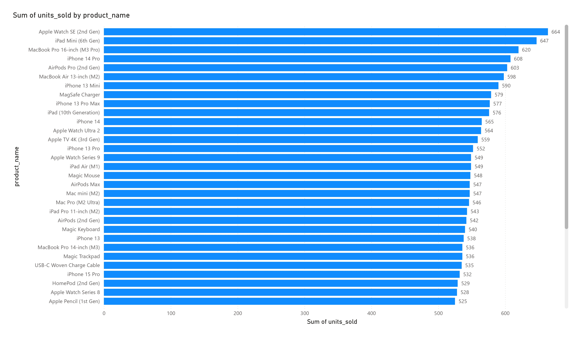

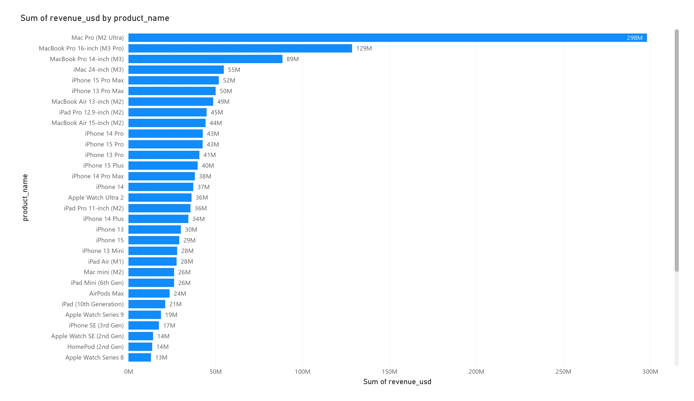

Berdasarkan hasil visualisasi data, ditemukan bahwa produk yang paling sering dibeli adalah Apple Watch SE (2nd Gen) dengan total penjualan sebanyak 664 unit, menunjukkan bahwa produk ini memiliki tingkat popularitas tinggi di kalangan konsumen, kemungkinan karena harga yang lebih terjangkau dan pasar yang lebih luas.

Namun, produk terlaris tidak selalu menjadi produk dengan revenue tertinggi. Dari sisi pendapatan, Mac Pro (M2 Ultra) menjadi produk dengan revenue tertinggi, menghasilkan sekitar 298 juta USD. Hal ini menunjukkan bahwa meskipun jumlah transaksi Mac Pro tidak sebanyak Apple Watch SE, harga jualnya yang sangat tinggi mampu memberikan kontribusi pendapatan terbesar.

Insight:
- Apple Watch SE (2nd Gen) unggul dalam volume penjualan (popularity)
- Mac Pro (M2 Ultra) unggul dalam total revenue (profit contribution)

Kesimpulan:

Popularitas produk tidak selalu berbanding lurus dengan pendapatan tertinggi. Produk dengan harga lebih terjangkau cenderung mendominasi jumlah penjualan, sedangkan produk premium berkontribusi lebih besar terhadap revenue meskipun volume penjualannya lebih rendah. Temuan ini menunjukkan pentingnya membedakan antara best-selling product dan highest revenue product dalam analisis bisnis.

### 2. Negara mana yang memberikan kontribusi revenue terbesar dalam USD?

Biar tahu market paling kuat secara bisnis, bukan sekadar efek mata uang lokal.

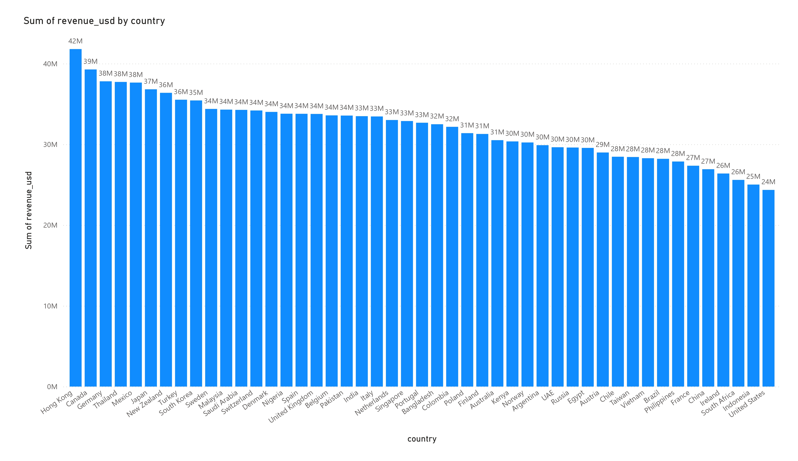

Berdasarkan hasil visualisasi revenue berdasarkan negara, Hong Kong memberikan kontribusi revenue terbesar dalam USD dengan total sekitar 42 juta USD, menjadikannya pasar dengan performa penjualan tertinggi dalam dataset.

Posisi berikutnya ditempati oleh Canada dengan sekitar 39 juta USD, disusul oleh Germany, Thailand, dan Mexico yang masing-masing berkontribusi sekitar 38 juta USD. Sementara itu, Japan berada di kisaran 37 juta USD, serta New Zealand dan Turkey sekitar 36 juta USD.

Top Kontributor Revenue:
1. Hong Kong — 42 juta USD
2. Canada — 39 juta USD
3. Germany, Thailand, Mexico — 38 juta USD
4. Japan — 37 juta USD
5. New Zealand, Turkey — 36 juta USD

Insight:

Hong Kong menunjukkan daya beli atau volume transaksi yang sangat kuat dibanding negara lain
Perbedaan revenue antarnegara relatif tidak terlalu jauh, menandakan distribusi pasar global yang cukup merata
Beberapa negara berkembang seperti Thailand dan Mexico mampu bersaing dengan negara maju dalam kontribusi revenue

Kesimpulan:

Kontribusi revenue terbesar tidak selalu hanya berasal dari negara dengan ekonomi terbesar, tetapi juga dipengaruhi oleh pola konsumsi, preferensi produk, serta volume transaksi. Hal ini menunjukkan bahwa pasar Apple memiliki distribusi global yang luas dengan beberapa negara non-tradisional juga memberikan kontribusi signifikan.

### 3. Apakah harga produk (unit_price_usd) memengaruhi jumlah pembelian (quantity)?

Mengetahui apakah harga tinggi menurunkan demand atau justru premium products tetap laku.

Berdasarkan hasil analisis korelasi, hubungan antara unit_price_usd dan quantity / units_sold memiliki nilai korelasi sebesar -0.003446. Nilai ini sangat mendekati nol, sehingga menunjukkan bahwa harga produk hampir tidak memiliki hubungan terhadap jumlah pembelian.

Meskipun terdapat arah korelasi negatif, nilainya sangat kecil sehingga dapat dianggap tidak signifikan. Hal ini menunjukkan bahwa produk dengan harga tinggi tidak selalu dibeli dalam jumlah sedikit, dan produk murah juga tidak selalu dibeli dalam jumlah banyak.

Insight:

- Harga produk bukan faktor utama yang memengaruhi quantity pembelian
- roduk premium Apple tetap memiliki demand meskipun harga tinggi
- Loyalitas brand dan kebutuhan pengguna kemungkinan lebih berpengaruh dibanding harga

Kesimpulan:

Dalam dataset ini, tidak ditemukan hubungan yang signifikan antara harga produk dan jumlah pembelian. Temuan ini menunjukkan bahwa perilaku konsumen terhadap produk Apple cenderung tidak terlalu sensitif terhadap harga, terutama pada produk-produk premium.

### 4. Storage mana yang paling diminati customer?

Insight penting untuk preferensi spesifikasi (128GB, 256GB, dll).

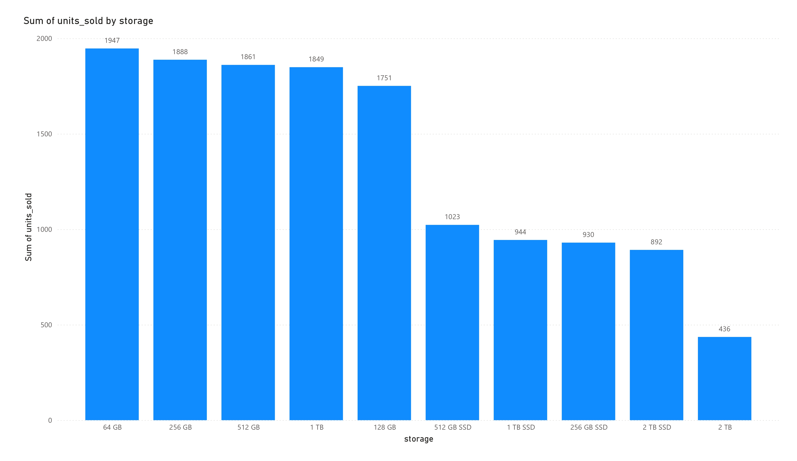

Berdasarkan hasil visualisasi jumlah unit terjual berdasarkan kapasitas penyimpanan (storage), ditemukan bahwa 64 GB merupakan kapasitas yang paling diminati pelanggan dengan total 1.947 unit terjual. Posisi berikutnya ditempati oleh 256 GB sebanyak 1.888 unit, 512 GB sebanyak 1.861 unit, dan 1 TB sebanyak 1.849 unit.

Top 5 Storage Terfavorit:
1. 64 GB — 1.947 unit
2. 256 GB — 1.888 unit
3. 512 GB — 1.861 unit
4. 1 TB — 1.849 unit
5. 128 GB — 1.751 unit

Insight:

Menariknya, perbedaan jumlah penjualan antara kapasitas penyimpanan relatif kecil, terutama pada rentang 64 GB hingga 1 TB. Hal ini menunjukkan bahwa pelanggan tidak hanya berfokus pada kapasitas penyimpanan yang rendah untuk menghemat biaya, tetapi juga bersedia memilih kapasitas yang lebih besar sesuai kebutuhan penggunaan mereka.

Selain itu, kapasitas 2 TB dan 2 TB SSD memiliki jumlah penjualan yang lebih rendah dibandingkan kapasitas lainnya. Hal ini mengindikasikan bahwa kebutuhan penyimpanan yang sangat besar hanya dibutuhkan oleh segmen pengguna tertentu, seperti profesional atau pengguna dengan kebutuhan komputasi tinggi.

Kesimpulan:

64 GB merupakan kapasitas penyimpanan yang paling diminati pelanggan, namun kapasitas yang lebih besar seperti 256 GB, 512 GB, dan 1 TB juga menunjukkan tingkat permintaan yang tinggi. Temuan ini mengindikasikan bahwa preferensi storage pelanggan Apple cukup beragam dan tidak hanya terpusat pada kapasitas penyimpanan yang paling murah atau paling kecil.

### 5. Produk dengan revenue tertinggi berasal dari banyak transaksi kecil atau sedikit transaksi besar?

Membantu memahami pola pembelian customer.

Berdasarkan hasil analisis, produk dengan revenue tertinggi yaitu Mac Pro (M2 Ultra) menghasilkan total revenue sebesar 3.724.222,55 USD. Meskipun bukan produk dengan penjualan unit terbanyak, Mac Pro tetap mampu menghasilkan revenue tertinggi karena memiliki harga jual yang sangat tinggi.

Sementara itu, produk dengan unit terjual terbanyak adalah Apple Watch SE (2nd Gen) dengan total 664 unit, sedangkan Mac Pro (M2 Ultra) terjual sebanyak 546 unit. Dari sisi jumlah transaksi, Apple Watch SE tercatat muncul dalam 312 transaksi, sedangkan Mac Pro dalam 275 transaksi.

Insight:

Hasil ini menunjukkan bahwa revenue tertinggi tidak selalu berasal dari banyak transaksi kecil, tetapi juga dapat berasal dari transaksi bernilai besar. Dalam kasus ini, Mac Pro (M2 Ultra) memiliki jumlah transaksi yang relatif tidak jauh berbeda dengan Apple Watch SE, namun karena harga produknya jauh lebih mahal, total revenue yang dihasilkan menjadi paling tinggi.

Kesimpulan:

Revenue tertinggi pada dataset lebih dipengaruhi oleh nilai transaksi yang besar (high-value product) dibandingkan hanya volume penjualan semata. Hal ini menunjukkan bahwa produk premium memiliki kontribusi signifikan terhadap total pendapatan meskipun frekuensi pembeliannya tidak sebanyak produk mass market.

### 6. Apakah customer rating berhubungan dengan revenue atau jenis produk tertentu?

Warna produk tertentu lebih diminati atau tidak berpengaruh signifikan?

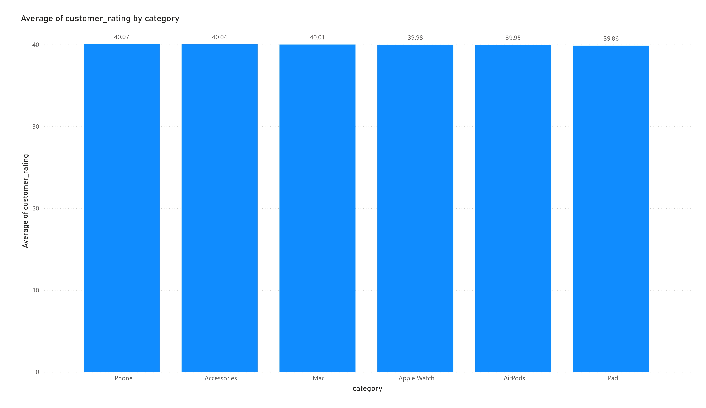

Berdasarkan hasil analisis korelasi, hubungan antara customer_rating dan revenue_usd memiliki nilai korelasi sebesar 0.001143, yang menunjukkan bahwa hampir tidak terdapat hubungan antara rating pelanggan dan revenue. Hal ini mengindikasikan bahwa produk dengan rating tinggi belum tentu menghasilkan revenue yang lebih besar, begitu juga sebaliknya.

Selain itu, hasil analisis rata-rata rating berdasarkan kategori produk menunjukkan bahwa seluruh kategori memiliki nilai rating yang relatif mirip, yaitu berada di sekitar angka 4.

Rata-rata Customer Rating per Category:

1. iPhone — 4.006
2. Accessories — 4.004
3. Mac — 4.001
4. Apple Watch — 3.998
5. AirPods — 3.995
6. iPad — 3.986

Insight:

- Seluruh kategori produk Apple memiliki tingkat kepuasan pelanggan yang cenderung tinggi dan stabil
- Perbedaan rating antar kategori sangat kecil, sehingga tidak ada kategori yang secara signifikan lebih disukai atau tidak disukai
- Revenue produk kemungkinan lebih dipengaruhi oleh faktor lain seperti harga produk, segmentasi pasar, dan kebutuhan konsumen dibanding customer rating

Kesimpulan:

Dalam dataset ini, customer rating tidak memiliki hubungan signifikan terhadap revenue maupun kategori produk tertentu. Hal ini menunjukkan bahwa hampir seluruh lini produk Apple mampu menjaga tingkat kepuasan pelanggan yang konsisten.

### 7. Warna produk tertentu lebih diminati atau tidak berpengaruh signifikan?

Bisa memberi insight tentang preferensi desain customer.

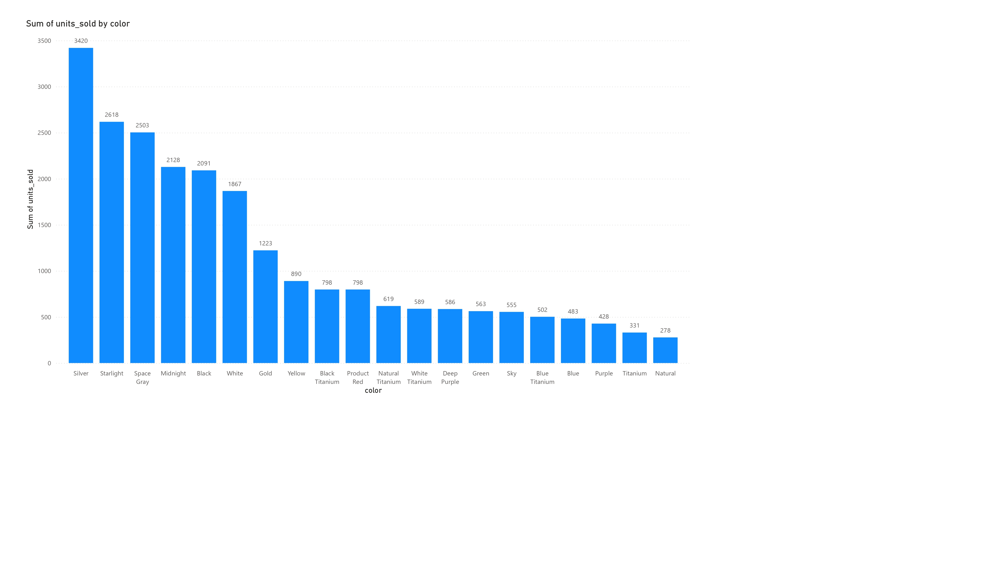

Berdasarkan hasil visualisasi data, ditemukan bahwa terdapat perbedaan preferensi warna produk di kalangan pelanggan. Tiga warna yang paling banyak dipilih adalah Silver dengan total 3.420 penjualan, diikuti Space Gray sebanyak 2.503 penjualan, dan Starlight sebanyak 2.416 penjualan.

Top 3 Warna Terfavorit:

1. Silver — 3.420 penjualan
2. Space Gray — 2.503 penjualan
3. Starlight — 2.416 penjualan

Insight:

Dominasi warna Silver, Space Gray, dan Starlight menunjukkan bahwa pelanggan Apple cenderung lebih menyukai warna-warna netral dan elegan dibandingkan warna yang lebih mencolok. Warna-warna tersebut dianggap lebih premium, profesional, serta cocok digunakan oleh berbagai segmen pengguna.

Kesimpulan:

Warna produk tampaknya memiliki pengaruh terhadap preferensi pembelian pelanggan. Hal ini terlihat dari adanya dominasi beberapa warna tertentu, khususnya Silver, Space Gray, dan Starlight, yang secara konsisten menjadi pilihan utama konsumen. Temuan ini menunjukkan bahwa aspek desain dan estetika produk turut berperan dalam keputusan pembelian pelanggan.

### 8. Apakah ada perbedaan pola pembelian antarnegara?

Misalnya negara tertentu lebih suka iPhone, MacBook, atau aksesori.

### 9. Outlier revenue besar berasal dari anomali data atau transaksi premium yang valid?

Penting untuk validasi kualitas data sekaligus memahami transaksi bernilai tinggi.

Berdasarkan hasil analisis terhadap variabel unit_price_usd, revenue_usd, fx_rate_to_usd, dan revenue_local_currency, ditemukan beberapa nilai ekstrem yang awalnya terindikasi sebagai outlier. Namun, setelah dilakukan validasi melalui analisis distribusi data, pemeriksaan top transaksi, serta pengecekan konteks bisnis, nilai-nilai tersebut terbukti merupakan transaksi premium yang valid dan bukan kesalahan data atau anomali.

Pada variabel unit_price_usd, nilai maksimum sebesar 7.551 USD berasal dari produk Mac Pro (M2 Ultra) yang memang termasuk kategori perangkat high-end dengan harga premium. Selanjutnya, pada revenue_usd, nilai tertinggi sebesar 59.529 USD berasal dari transaksi pembelian Mac Pro (M2 Ultra) sebanyak 5–8 unit, sehingga revenue besar tersebut masih logis secara bisnis.

Sementara itu, nilai maksimum pada fx_rate_to_usd sebesar 24.500 juga bukan anomali, melainkan representasi kurs riil 1 USD terhadap Dong Vietnam pada periode 2022–2024. Dampak dari tingginya nilai tukar tersebut kemudian memengaruhi variabel revenue_local_currency, di mana nilai sebesar 507.517.500 berasal dari kombinasi kurs Vietnam yang tinggi dan transaksi pembelian produk premium bernilai besar.

Insight:

- Nilai ekstrem pada dataset lebih banyak berasal dari transaksi premium yang valid dibanding kesalahan data
- Produk high-end seperti Mac Pro (M2 Ultra) memiliki kontribusi besar terhadap revenue
- Perbedaan nilai tukar antarnegara dapat menghasilkan revenue lokal yang sangat besar
- Tidak semua outlier harus dihapus karena beberapa merepresentasikan kondisi bisnis nyata

Kesimpulan:

Outlier revenue besar pada dataset ini bukan disebabkan oleh anomali data, melainkan berasal dari kombinasi transaksi premium, harga produk high-end, dan perbedaan kurs mata uang antarnegara. Oleh karena itu, nilai-nilai tersebut dipertahankan agar dataset tetap mampu merepresentasikan kondisi bisnis secara realistis dan menyeluruh.

### 10. Faktor apa yang paling berpengaruh terhadap revenue: harga, quantity, negara, atau kategori produk?

Ini inti business insight paling penting untuk strategi penjualan.

Berdasarkan hasil analisis korelasi, faktor yang paling berpengaruh terhadap revenue_usd adalah unit_price_usd dengan nilai korelasi sebesar 0.755070, yang menunjukkan hubungan positif kuat antara harga produk dan revenue. Hal ini mengindikasikan bahwa semakin tinggi harga produk, maka revenue yang dihasilkan cenderung semakin besar.

Sementara itu, variabel units_sold memiliki korelasi sebesar 0.384497, yang menunjukkan hubungan positif namun tidak sekuat harga produk. Artinya, jumlah unit terjual memang memengaruhi revenue, tetapi kontribusinya masih lebih kecil dibanding harga produk itu sendiri.

Di sisi lain, revenue_local_currency hanya memiliki korelasi sebesar 0.139827, sehingga pengaruhnya terhadap revenue_usd relatif lemah. Hal ini menunjukkan bahwa perbedaan mata uang lokal tidak terlalu menentukan besar kecilnya revenue dalam USD.

Insight:

- Revenue lebih dipengaruhi oleh produk dengan harga tinggi dibanding volume penjualan
- Produk premium seperti Mac Pro memberikan kontribusi besar terhadap total revenue
- Quantity tetap berpengaruh, tetapi bukan faktor utama
- Faktor mata uang lokal memiliki pengaruh yang relatif kecil terhadap revenue dalam USD

Kesimpulan:

Dalam dataset ini, harga produk (unit_price_usd) merupakan faktor yang paling berpengaruh terhadap revenue. Temuan ini menunjukkan bahwa strategi penjualan produk premium memiliki dampak yang lebih besar terhadap peningkatan pendapatan dibanding hanya meningkatkan jumlah unit terjual.
